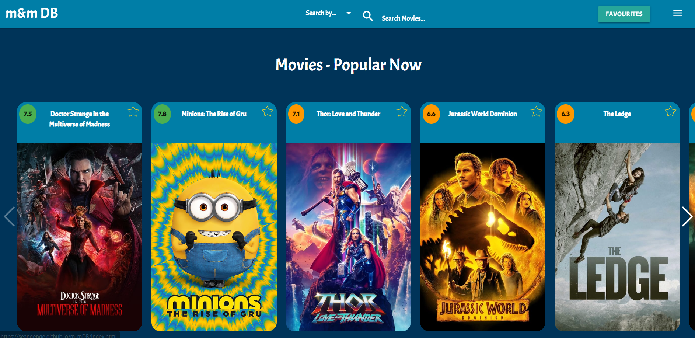
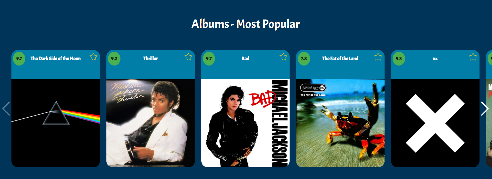
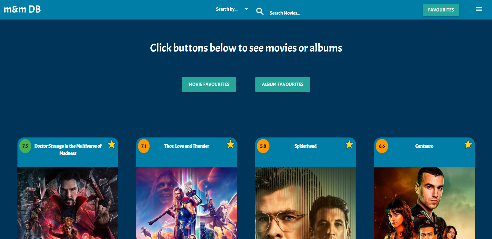
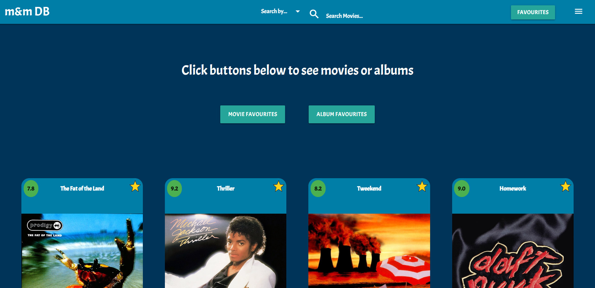
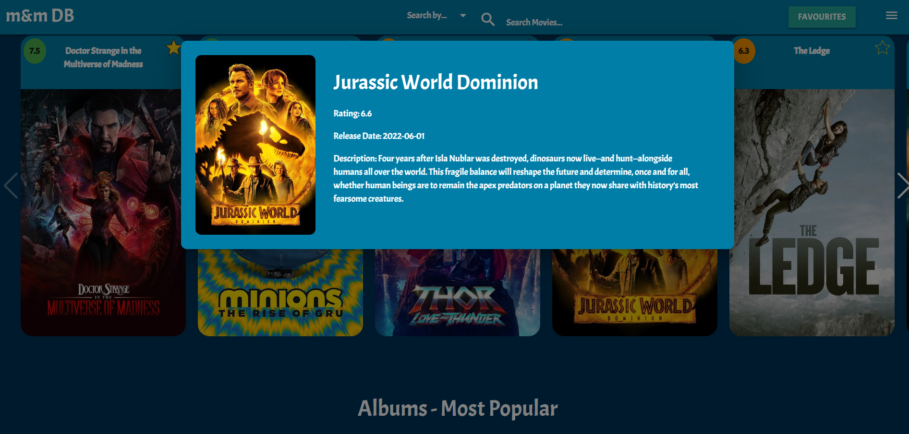
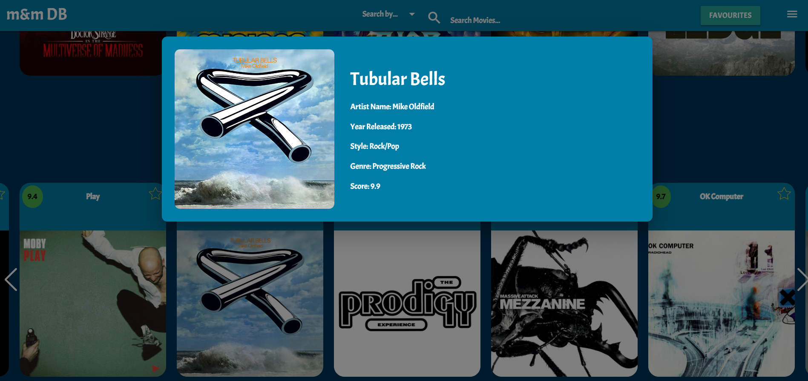
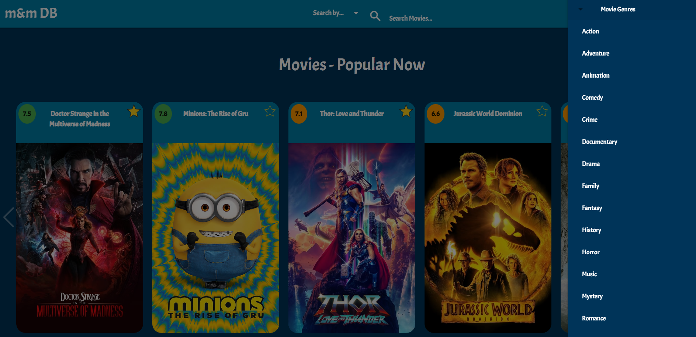
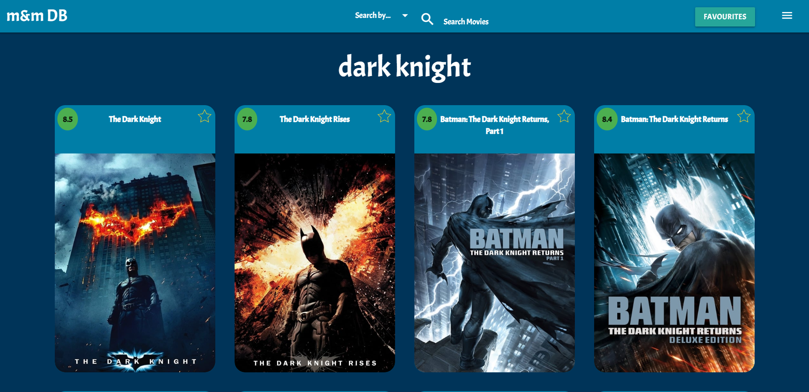
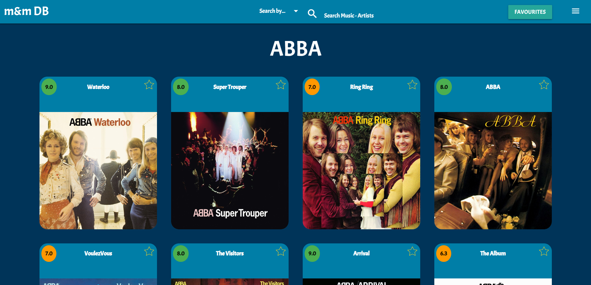

# m&m DB (Movies and Music Database)

## Description
This website allows user to find out more information about movies and song albums.

On the home page, there are two carousels, one for popular movies, and the other for popular albums. There are buttons on the left and right side of these carousels that can be used to scroll through the cards.

Once a movie or album is clicked by the user, a modal window pops up which shows the user more information about the movie/album.

A user can click the star icon on the top-right of each card to add that movie/album to their favourites list. The star icon will change accordingly. The user may repeated toggle a movie/album from their favourites list.

On the navigation bar located at the top of the webpage on all pages, there is a favourites button which when clicked, will take users to the favourites page. Here, the user can check the movies they have favourited or the albums they have favourited or both at the same time. When the page is reloaded, the items added to favourites will persist.

On the navigation bar, there is a hamburger icon on the right side, when this is clicked, a side bar emerges from the right. The user can use this side bar to search for movies based of genre or release date.

There is also a search bar on the navigation. A user can choose to search by movie name or by artist name. Once the user has typed into the search bar and pressed the 'enter' key, a number of movies or albums will be displayed based off the search input.

## Screenshots of Application

## Home Page -  Navigation Bar and Movie Carousel

## Home Page - Album Carousel

## Favourites Page - Movies

## Favourites Page - Albums

## Modal Window for Movies

## Modal Window for Albums

## Side Bar

## Search Page - Movies

## Search Page - Albums

## Link to deployed application
Deployed app: https://seangenge.github.io/m-mDB/

